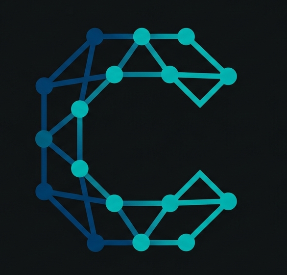

# CppNet

<div align="center">
  
</div>

<p align="center">
  <b>CppNet</b> is a high-performance C++17 deep learning library for building and training neural networks from scratch.<br/>
  Built on <a href="https://eigen.tuxfamily.org">Eigen</a> for fast tensor operations,
  <a href="https://www.openmp.org/">OpenMP</a> for CPU parallelism,
  and <a href="https://developer.nvidia.com/cuda-zone">CUDA</a> for GPU acceleration.
</p>

<p align="center">
  <a href="#installation"></a>
  <a href="#installation"></a>
  <a href="LICENSE"></a>
  <a href="#gpu-acceleration"></a>
</p>

---

## Table of Contents

- [Features](#features)
- [Installation](#installation)
- [Quick Start](#quick-start)
- [API Overview](#api-overview)
  - [Layers](#layers)
  - [Activations](#activations)
  - [Losses](#losses)
  - [Optimizers](#optimizers)
  - [Metrics](#metrics)
  - [Regularizations](#regularizations)
  - [Utilities](#utilities)
  - [Visualization](#visualization)
- [Examples](#examples)
- [GPU Acceleration](#gpu-acceleration)
- [Benchmarks](#benchmarks)
- [Testing](#testing)
- [Project Structure](#project-structure)
- [Roadmap](#roadmap)
- [Contributing](#contributing)
- [License](#license)

---

## Features

- **High Performance** — Vectorized tensor operations via Eigen, multi-threaded with OpenMP, full CUDA GPU backend for all layers, activations, losses, and optimizers.
- **Rich Layer Library** — Linear, Conv2D, MaxPool2D, RNN, LSTM, GRU, Multi-Head Attention, Dropout, BatchNorm, Embedding, Residual, GlobalPool, MeanPool1D, Flatten.
- **Multiple Backends** — Per-layer compute backend selection: `"cpu-eigen"` (Eigen contractions), `"cpu"` (OpenMP loops), `"gpu"` (CUDA kernels).
- **Complete CUDA Coverage** — 41 CUDA kernel files covering all layers, activations, losses, and optimizers for end-to-end GPU training.
- **Modular Architecture** — Clean separation of layers, activations, losses, optimizers, metrics, regularizations, and utilities.
- **Training Utilities** — DataLoader with batching & shuffling, learning rate schedulers, early stopping callbacks, gradient clipping, model serialization.
- **Visualization** — Built-in `TrainingLogger` for tracking metrics and exporting training history to CSV.
- **Extensible** — Abstract base classes for layers, losses, and optimizers make it straightforward to add custom components.
- **Single-Header Access** — `#include <CppNet/CppNet.hpp>` brings in the entire library.

---

## Installation

### Prerequisites

| Dependency | Version | Required |
|:-----------|:--------|:---------|
| C++ compiler (GCC, Clang, MSVC) | C++17 support | Yes |
| [CMake](https://cmake.org) | &ge; 3.18 | Yes |
| [Eigen3](https://eigen.tuxfamily.org) | &ge; 3.3 | Yes |
| [OpenMP](https://www.openmp.org/) | any | Optional (CPU parallelism) |
| [CUDA Toolkit](https://developer.nvidia.com/cuda-zone) | any | Optional (GPU acceleration) |

### Build from Source

```bash
git clone https://github.com/LoqmanSamani/CppNet.git
cd CppNet
mkdir build && cd build
cmake .. -DCMAKE_BUILD_TYPE=Release
make -j$(nproc)
```

### Install System-Wide

```bash
sudo make install
```

This installs headers to `/usr/local/include/CppNet/` and the static library to `/usr/local/lib/`.

### Use in Your CMake Project

```cmake
find_package(CppNet REQUIRED)
target_link_libraries(your_target PRIVATE CppNet::CppNet)
```

---

## Quick Start

A minimal binary classification example:

```cpp
#include <CppNet/CppNet.hpp>
#include <iostream>

int main() {
    // Define layers
    CppNet::Layers::Linear layer1(30, 64, "fc1", true, true, "cpu-eigen", "xavier");
    CppNet::Layers::Linear layer2(64, 1,  "fc2", true, true, "cpu-eigen", "xavier");
    CppNet::Activations::ReLU relu("cpu-eigen");
    CppNet::Activations::Sigmoid sigmoid;

    // Loss & optimizer
    CppNet::Losses::BinaryCrossEntropy loss_fn("mean");
    CppNet::Optimizers::Adam optimizer;
    float lr = 0.001;

    // Training loop
    for (int epoch = 0; epoch < 100; ++epoch) {
        auto h = relu.forward(layer1.forward(X_train));
        auto pred = sigmoid.forward(layer2.forward(h));

        float loss = loss_fn.forward(pred, Y_train);
        auto grad = loss_fn.backward(pred, Y_train);

        grad = layer2.backward(sigmoid.backward(grad));
        layer1.backward(relu.backward(grad));

        layer2.step(optimizer, lr);
        layer1.step(optimizer, lr);

        std::cout << "Epoch " << epoch << " — Loss: " << loss << std::endl;
    }
    return 0;
}
```

---

## API Overview

### Layers

All layers inherit from `CppNet::Layers::Layer` and implement `forward()`, `backward()`, `step()`, `freeze()`, `unfreeze()`, and `print_layer_info()`.

| Layer | Description | Key Parameters |
|:------|:------------|:---------------|
| `Linear` | Fully connected layer | `in_size`, `out_size`, `bias`, `device`, `weight_init` |
| `Conv2D` | 2D convolution | `in_channels`, `out_channels`, `kernel_size`, `stride`, `padding` |
| `MaxPool2D` | 2D max pooling | `kernel_size`, `stride` |
| `Flatten` | Reshape to 2D | — |
| `RNN` | Vanilla recurrent layer | `input_size`, `hidden_size` |
| `LSTM` | Long Short-Term Memory | `input_size`, `hidden_size` |
| `GRU` | Gated Recurrent Unit | `input_size`, `hidden_size` |
| `MultiHeadAttention` | Scaled dot-product multi-head attention | `embed_dim`, `num_heads` |
| `Dropout` | Dropout regularization | `drop_rate` |
| `BatchNorm` | Batch normalization | `num_features` |
| `Embedding` | Embedding lookup table | `vocab_size`, `embed_dim` |
| `Residual` | Residual (skip) connection wrapper | — |
| `GlobalPool` | Global average/max pooling | — |
| `MeanPool1D` | Mean pooling over sequence dimension | — |

### Activations

| Activation | Function |
|:-----------|:---------|
| `ReLU` | $\max(0, x)$ |
| `LeakyReLU` | $\max(\alpha x, x)$ |
| `Sigmoid` | $\sigma(x) = \frac{1}{1 + e^{-x}}$ |
| `Tanh` | $\tanh(x)$ |
| `Softmax` | $\frac{e^{x_i}}{\sum_j e^{x_j}}$ |

All activations support both 2D and 4D tensor inputs and run on all three backends (`cpu-eigen`, `cpu`, `gpu`).

### Losses

| Loss | Typical Use |
|:-----|:------------|
| `MSE` | Regression |
| `MAE` | Regression |
| `Huber` | Robust regression |
| `BinaryCrossEntropy` | Binary classification |
| `CategoricalCrossEntropy` | Multi-class classification |
| `SoftmaxCrossEntropy` | Multi-class (fused softmax + CE) |

All support configurable reduction modes (`"mean"`, `"sum"`) and CUDA GPU acceleration.

### Optimizers

| Optimizer | Description |
|:----------|:------------|
| `SGD` | Stochastic Gradient Descent |
| `Adam` | Adaptive Moment Estimation (default: $\beta_1=0.9$, $\beta_2=0.999$, $\epsilon=10^{-8}$) |
| `Adagrad` | Adaptive gradient accumulation |
| `Momentum` | SGD with momentum |
| `RMSProp` | Root Mean Square Propagation |

All optimizers have dedicated CUDA kernels for GPU-side weight updates.

### Metrics

```cpp
CppNet::Metrics::accuracy(predictions, targets);
CppNet::Metrics::binary_accuracy(predictions, targets, 0.5);
CppNet::Metrics::precision(predictions, targets, 0.5);
CppNet::Metrics::recall(predictions, targets, 0.5);
CppNet::Metrics::f1_score(predictions, targets, 0.5);
```

### Regularizations

```cpp
CppNet::Regularizations::l1_penalty(weights, lambda);
CppNet::Regularizations::l2_penalty(weights, lambda);
CppNet::Regularizations::elastic_net_penalty(weights, lambda, l1_ratio);
// Corresponding gradient functions: l1_gradient, l2_gradient, elastic_net_gradient
```

### Utilities

| Utility | Description |
|:--------|:------------|
| **DataLoader** | Batched iteration with shuffling. Supports range-based `for` loops. |
| **Weight Init** | Xavier (uniform/normal), He (uniform/normal), constant, custom. |
| **Gradient Clipping** | `clip_by_value()` and `clip_by_norm()`. |
| **Serialization** | `save_model()` / `load_model()` for full model persistence; tensor-level binary I/O. |
| **LR Schedulers** | `StepLR`, `ExponentialLR`, `CosineAnnealingLR`. |
| **Callbacks** | `EarlyStopping` with configurable patience, delta, and mode. |
| **Elapsed Time** | Training duration measurement. |

**DataLoader example:**

```cpp
CppNet::Utils::DataLoader loader(X, Y, /*batch_size=*/32, /*shuffle=*/true);
for (auto& [x_batch, y_batch] : loader) {
    // forward / backward / step
}
loader.reset(); // re-shuffle for next epoch
```

**Learning rate scheduler example:**

```cpp
CppNet::Schedulers::CosineAnnealingLR scheduler(/*initial_lr=*/0.01, /*T_max=*/100);
for (int epoch = 0; epoch < 100; ++epoch) {
    float lr = scheduler.step();
    // ... train with lr
}
```

### Visualization

```cpp
CppNet::Visualizations::TrainingLogger logger;
// Inside training loop:
logger.log("train_loss", loss);
logger.log("val_accuracy", val_acc);
logger.next_epoch();
// After training:
logger.print_epoch_summary();
logger.export_csv("training_history.csv");
```

---

## Examples

The `examples/` directory contains complete, self-contained deep learning programs that train on **synthetic data** — no downloads required. Each example generates its own dataset, trains a model, and reports final metrics.

| Example | Architecture | Dataset | Key Components | Result |
|:--------|:------------|:--------|:---------------|:-------|
| [`mlp_classification.cpp`](examples/mlp_classification.cpp) | Linear→ReLU→Linear→ReLU→Linear | 3-class spiral (600 samples, 2D) | ReLU, SoftmaxCrossEntropy, Adam | **~75% accuracy** |
| [`cnn_image_classification.cpp`](examples/cnn_image_classification.cpp) | Conv2D→ReLU→MaxPool2D→Flatten→Linear | 8×8 stripe images (400 samples) | Conv2D, MaxPool2D, SoftmaxCrossEntropy, Adam | **100% accuracy** |
| [`rnn_sequence_prediction.cpp`](examples/rnn_sequence_prediction.cpp) | LSTM(1,16)→Linear(16,1) | Sine-wave sequences (400 samples) | LSTM, MSE, Adam | **MSE ≈ 0.00001** |
| [`gru_sequence_prediction.cpp`](examples/gru_sequence_prediction.cpp) | GRU(1,16)→Linear(16,1) | Sine-wave sequences (400 samples) | GRU, MAE, Momentum | **MAE ≈ 0.010** |
| [`transformer_classifier.cpp`](examples/transformer_classifier.cpp) | Embedding→Attention+skip→ReLU→Linear | Token sequences (400 samples) | Embedding, MultiHeadAttention, MeanPool1D | **100% accuracy** |
| [`resnet_classifier.cpp`](examples/resnet_classifier.cpp) | Linear→ReLU→ResBlock(32)→Linear→Sigmoid | Concentric circles (600 samples) | Residual, GradientClip, He init | **~99% accuracy** |
| [`regularized_cnn.cpp`](examples/regularized_cnn.cpp) | Conv2D→LeakyReLU→Pool→BN→Dropout→FC | 8×8 pattern images (600 samples, 3 classes) | BatchNorm, Dropout, LeakyReLU, CategoricalCrossEntropy, Adagrad | **100% accuracy** |
| [`optimizer_comparison.cpp`](examples/optimizer_comparison.cpp) | Linear→Tanh→Linear→Tanh→Linear | Regression: y = sin(x₀)·cos(x₁) (500 samples) | SGD, Momentum, Adagrad, RMSProp, Adam, Tanh, Huber | **loss ≈ 0.002** |

Build and run:

```bash
cd build
cmake .. -DCMAKE_BUILD_TYPE=Release -DBUILD_EXAMPLES=ON
make -j$(nproc)
./examples/mlp_classification
./examples/cnn_image_classification
./examples/rnn_sequence_prediction
./examples/gru_sequence_prediction
./examples/transformer_classifier
./examples/resnet_classifier
./examples/regularized_cnn
./examples/optimizer_comparison
```

---

## GPU Acceleration

CppNet provides **full CUDA GPU support** across all layers, activations, losses, and optimizers. When CUDA is detected at build time, layers can target the GPU backend:

```cpp
CppNet::Layers::Linear layer(784, 256, "fc1", true, true, "gpu", "xavier");
```

### CUDA Kernel Coverage (41 kernels)

| Category | CUDA Kernels |
|:---------|:-------------|
| **Linear algebra** | `matmul`, `matmul_grad_input`, `matmul_grad_weight`, `add_bias`, `bias_grad`, `elementwise` |
| **Convolution** | `conv2d_forward`, `conv2d_backward`, `maxpool2d_forward`, `maxpool2d_backward` |
| **Recurrent** | `rnn_cell`, `lstm_cell`, `gru_cell` |
| **Attention** | `attention_scores` (scale, softmax, backward), `embedding_forward`, `embedding_backward` |
| **Normalization** | `batch_norm_forward`, `batch_norm_backward`, `dropout` |
| **Pooling** | `global_avg_pool2d`, `global_max_pool2d`, `mean_pool1d` |
| **Activations** | `relu`, `relu_grad`, `leaky_relu`, `leaky_relu_grad`, `sigmoid`, `sigmoid_grad`, `tanh_activation`, `tanh_activation_grad` |
| **Losses** | `mse`, `mae`, `huber`, `bce`, `categorical_ce`, `softmax_ce` |
| **Optimizers** | `sgd_step`, `momentum_step`, `adagrad_step`, `rmsprop_step`, `adam_step` |

To force a CPU-only build even when CUDA is present:

```bash
cmake .. -DCUDAToolkit_ROOT=/nonexistent
```

---

## Benchmarks

Five benchmarks compare three compute backends — **cpu-eigen** (Eigen SIMD contractions), **cpu** (OpenMP loops), and **gpu** (CUDA kernels) — across different architectures and model sizes. All benchmarks are reproducible via the scripts in the [`benchmarks/`](benchmarks/) directory.

### Summary of GPU Speedups

| Architecture | Model Size | GPU Speedup vs cpu-eigen | Key Observation |
|:-------------|:-----------|:-------------------------|:----------------|
| **MLP** | Small (4.5K params) | 2.0x | GPU overhead limits gains for small matmuls |
| | Medium (66K params) | 6.9x | — |
| | Large (660K params) | 14.3x | — |
| | XLarge (2.6M params) | 25.3x | Sub-linear GPU time scaling with params |
| **CNN** | Small (Conv16→32) | 28.8x | Convolution is highly GPU-parallel |
| | Medium (Conv32→64→FC128) | 42.0x | Highest CNN speedup |
| **RNN/LSTM/GRU** | Small (H=64) | 2.2–5.2x | GRU benefits most from GPU |
| | Medium (H=128) | 4.7–15.5x | — |
| | Large (H=256) | 12.2–56.4x | GRU Large achieves **56.4x** — highest overall |
| **Transformer** | Small (d=32, h=2) | 0.5x (slower) | GPU overhead dominates at small scale |
| | Medium (d=64, h=4) | 1.0x (break-even) | — |
| | Large (d=128, h=8) | 1.2x | Modest gain; hybrid CPU/GPU attention |
| **ResNet** | Small (W=64, D=2) | 1.6x | Depth amplifies GPU advantage |
| | Medium (W=128, D=4) | 6.7x | — |
| | Large (W=256, D=6) | 9.0x | Skip connections add negligible overhead |

### Key Findings

- **GPU advantage grows with model size.** Across all architectures, larger models see dramatically higher GPU speedups as matrix sizes better saturate GPU cores.
- **CNNs and recurrent layers benefit most from GPU.** Convolution achieves up to **42x** speedup; GRU achieves up to **56.4x** — the highest across all benchmarks.
- **Transformers show modest GPU gains** at tested scales due to mixed operations (embedding lookups, attention softmax, multiple small projections) and a hybrid CPU/GPU attention path.
- **Eigen (`cpu-eigen`) consistently outperforms OpenMP (`cpu`)** for all architectures, leveraging SIMD vectorization and cache-optimal memory layouts.
- **Numerical consistency is verified** across all backends — all devices converge to equivalent loss and accuracy values.

### Average GPU Speedups by Architecture

| Architecture | Avg GPU Speedup | Best GPU Speedup | Best Config |
|:-------------|:----------------|:-----------------|:------------|
| MLP | **12.1x** | 25.3x | XLarge (2.6M params) |
| CNN | **35.4x** | 42.0x | Medium (Conv32→64→FC128) |
| Sequence (RNN/LSTM/GRU) | **13.7x** | 56.4x | GRU Large (H=256, seq=50) |
| Transformer | **0.9x** | 1.2x | Large (d=128, h=8) |
| ResNet | **5.8x** | 9.0x | Large (W=256, D=6) |

### How to Reproduce

```bash
cd build
cmake .. -DCMAKE_BUILD_TYPE=Release -DBUILD_BENCHMARKS=ON
make -j$(nproc)
./benchmarks/mlp_benchmark
./benchmarks/cnn_benchmark
./benchmarks/sequence_benchmark
./benchmarks/transformer_benchmark
./benchmarks/residual_benchmark
```

> See [`benchmarks/benchmarks.md`](benchmarks/benchmarks.md) for full per-epoch results, detailed speedup analysis, and methodology.

---

## Testing

CppNet has **41 unit tests** with **377 test cases** covering every module:

```bash
cd build
cmake .. -DBUILD_TESTS=ON
make -j$(nproc)
ctest --output-on-failure
```

| Category | Tests | Test Cases |
|:---------|:------|:-----------|
| **Layers** (13) | Linear, Conv2D, Flatten, MaxPool2D, RNN, Attention, BatchNorm, Dropout, Embedding, GlobalPool, GRU, LSTM, Residual | 123 |
| **Activations** (5) | ReLU, Sigmoid, Softmax, Tanh, LeakyReLU | 55 |
| **Losses** (6) | BinaryCrossEntropy, CategoricalCrossEntropy, MSE, MAE, Huber, SoftmaxCrossEntropy | 52 |
| **Optimizers** (5) | SGD, Adam, Momentum, Adagrad, RMSProp | 34 |
| **Utilities** (7) | Metrics, Regularizations, Callbacks, DataLoader, ElapsedTime, GradientClip, Init | 65 |
| **GPU Kernels** (1) | GPU matmul via Linear layer (forward, backward, step, CPU/GPU comparison) | 7 |
| **Other** (4) | Schedulers, Utils, Models, Visualizations | 41 |

Each test validates forward pass, backward pass (gradient shapes & values), parameter updates, and GPU/CPU numerical consistency where applicable.

---

## Project Structure

```
CppNet/
├── CMakeLists.txt              # Top-level build configuration
├── cmake/                      # CMake package config templates
├── include/CppNet/             # Public headers
│   ├── CppNet.hpp              # Single-include entry point
│   ├── activations/            # ReLU, Sigmoid, Softmax, Tanh, LeakyReLU
│   ├── layers/                 # Linear, Conv2D, RNN, LSTM, GRU, Attention, ...
│   ├── losses/                 # MSE, MAE, Huber, BCE, CCE, SoftmaxCE
│   ├── optimizers/             # SGD, Adam, Adagrad, Momentum, RMSProp
│   ├── models/                 # SequentialModel
│   ├── metrics/                # Accuracy, Precision, Recall, F1
│   ├── regularizations/        # L1, L2, Elastic Net
│   ├── kernels/gpu/            # CUDA kernel declarations
│   ├── utils/                  # DataLoader, Init, Schedulers, Serialization, ...
│   └── visualizations/         # TrainingLogger
├── src/CppNet/                 # Implementation files (.cpp / .cu)
│   └── kernels/gpu/            # 41 CUDA kernel implementations
├── tests/                      # 41 unit tests (377 test cases)
├── examples/                   # 8 deep learning examples
├── benchmarks/                 # 5 device benchmarks (CPU vs GPU)
└── docs/                       # Additional documentation
```

---

## Roadmap

- [x] Core layer library (Linear, Conv2D, Pooling, RNN, LSTM, GRU, Attention, BatchNorm, Dropout, Embedding, Residual)
- [x] Activation functions (ReLU, Sigmoid, Tanh, Softmax, LeakyReLU)
- [x] Loss functions (MSE, MAE, Huber, BCE, CCE, SoftmaxCE)
- [x] Optimizers (SGD, Adam, Adagrad, Momentum, RMSProp)
- [x] DataLoader, LR schedulers, early stopping, gradient clipping
- [x] Model serialization (save/load)
- [x] Full CUDA GPU backend — 41 kernels covering all layers, activations, losses, and optimizers
- [x] OpenMP CPU parallelism
- [x] Comprehensive test suite (41 tests, 377 test cases)
- [x] Deep learning examples (MLP, CNN, RNN/LSTM, GRU, Transformer, ResNet, Regularized CNN, Optimizer Comparison)
- [x] Device benchmarks (MLP, CNN, Sequence, Transformer, ResNet)
- [ ] Add Trainer abstraction with built-in training loop
- [ ] Additional examples (GANs, Reinforcement Learning, NLP pipelines)
- [ ] Python bindings (pybind11)
- [ ] Comprehensive API reference documentation

---

## Contributing

Contributions are welcome! To get started:

1. Fork the repository and create a feature branch.
2. Follow the existing coding style — headers in `include/CppNet/`, implementations in `src/CppNet/`.
3. Add tests for new functionality in `tests/`.
4. Make sure all tests pass: `cd build && ctest --output-on-failure`.
5. Open a pull request with a clear description of your changes.

---

## License

CppNet is released under the [MIT License](LICENSE).

Copyright &copy; 2025 Loghman Samani
